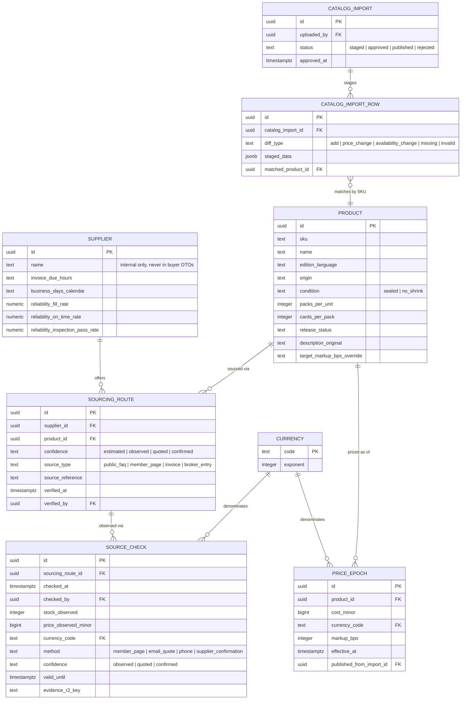
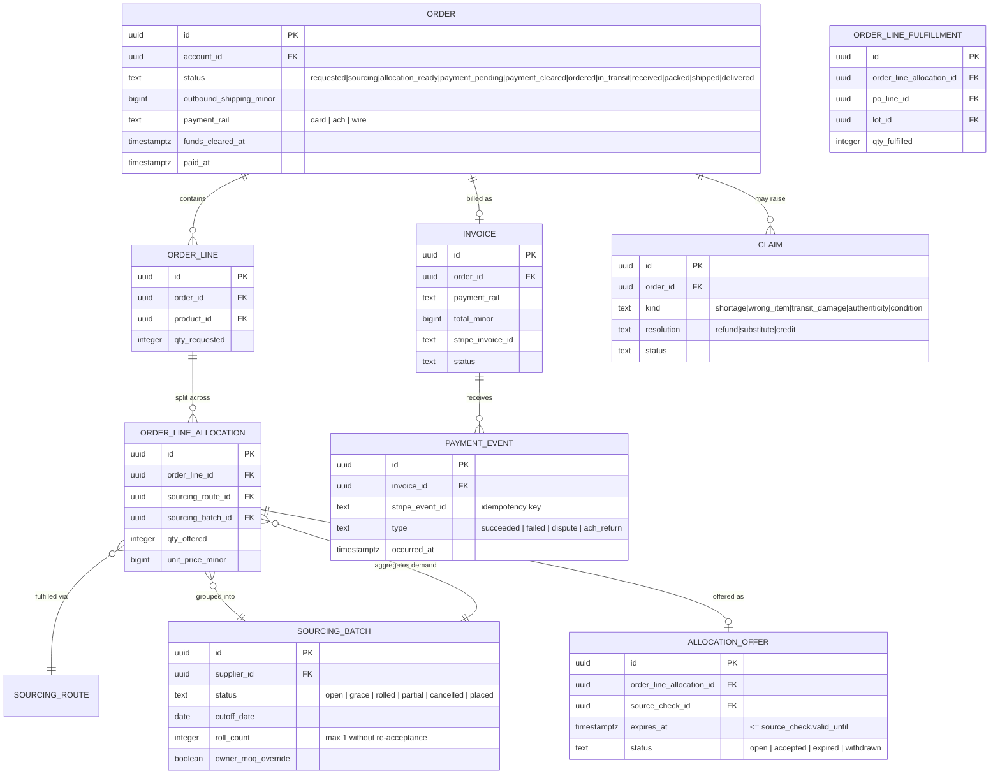
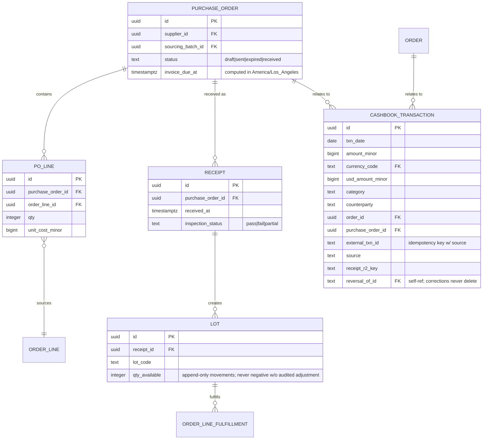

# Amended Schema Diagram

This is the intended end-state schema across all phases, amended from the flaws the build
prompt identified in "v2.0" (see `PROJECT_SCOPE_FINAL.md` §3). Phase 1 implements only the
**Identity, Audit & Applications** cluster below; later clusters are shown so the owners can
review the target shape before Phase 2+ migrations are written against it. Column lists are
representative, not exhaustive — full column definitions live in the Drizzle schema files as
each phase is built.

Conventions used throughout:

- Every money value is a pair: `*_amount_minor bigint` + `currency_code` referencing
  `currency.code`, which carries `exponent`. No code path assumes exponent 2.
- Every table has `id uuid primary key default gen_random_uuid()`, `created_at`, and
  `updated_at` unless noted. Omitted from the diagram for brevity.
- `audit_log` is append-only and referenced conceptually by every mutating table; not drawn as
  an FK edge to avoid a diagram with an edge into every box.

## Cluster 1 — Identity, Audit & Applications (Phase 1)

```mermaid
erDiagram
    USER ||--o{ SESSION : "has"
    USER ||--o{ TOTP_CREDENTIAL : "has"
    USER ||--o{ RECOVERY_CODE : "has"
    USER ||--o{ API_KEY : "issues (ai_operator)"
    USER ||--o{ AUDIT_LOG : "actor"
    USER ||--o{ AGENT_PROPOSAL : "decides"

    ACCOUNT ||--o{ ACCOUNT_USER : "has members"
    USER ||--o{ ACCOUNT_USER : "belongs to"
    ACCOUNT ||--o{ APPLICATION : "originates from"
    ACCOUNT ||--o{ TAX_DETERMINATION : "has"

    APPLICATION ||--o{ APPLICATION_DOCUMENT : "attaches"
    APPLICATION ||--o{ APPLICATION_STATUS_EVENT : "logs"
    APPLICATION ||--o| ACCOUNT : "creates on approval"

    TERMS_VERSION ||--o{ TERMS_ACCEPTANCE : "accepted as"
    ACCOUNT ||--o{ TERMS_ACCEPTANCE : "accepts"

    AGENT_PROPOSAL }o--|| USER : "proposed by (ai_operator identity)"

    COMPLIANCE_TASK

    USER {
        uuid id PK
        text email
        text name
        text role "owner | ai_operator"
        boolean active
        timestamptz created_at
    }
    SESSION {
        uuid id PK
        uuid user_id FK
        text token_hash
        timestamptz expires_at
        text ip
        text user_agent
    }
    TOTP_CREDENTIAL {
        uuid id PK
        uuid user_id FK
        text secret_encrypted
        timestamptz confirmed_at
    }
    RECOVERY_CODE {
        uuid id PK
        uuid user_id FK
        text code_hash
        timestamptz used_at
    }
    API_KEY {
        uuid id PK
        uuid user_id FK "ai_operator only"
        text key_hash
        text scopes "read-only by default; cost_stack:read explicit"
        timestamptz revoked_at
        timestamptz last_used_at
    }
    ACCOUNT {
        uuid id PK
        text legal_name
        text channel_type "vending | smoke_shop | retail | live_seller | event_seller"
        text tax_status "pending | exempt | taxable"
        text approval_status "pending | approved | needs_review | declined"
        timestamptz approved_at
    }
    ACCOUNT_USER {
        uuid account_id FK
        uuid user_id FK
        text role_on_account
    }
    APPLICATION {
        uuid id PK
        uuid account_id FK "null until approved"
        text status "draft | submitted | needs_review | approved | declined"
        text resume_token_hash
        numeric triage_score "sorts queue only, never auto-declines"
        text needs_review_reasons "plain-language array"
        timestamptz submitted_at
    }
    APPLICATION_DOCUMENT {
        uuid id PK
        uuid application_id FK
        text doc_type "sellers_permit | resale_cert_cdtfa230 | equivalent | channel_evidence"
        text r2_object_key "random key, private bucket"
        text mime_verified "sniffed from content, not extension"
        timestamptz retention_delete_at "default +90d for declined/abandoned"
    }
    APPLICATION_STATUS_EVENT {
        uuid id PK
        uuid application_id FK
        text from_status
        text to_status
        uuid actor_user_id FK
        text reason
    }
    TAX_DETERMINATION {
        uuid id PK
        uuid account_id FK
        text status "pending | exempt | taxable"
        text evidence_r2_key
        text notes
        uuid determined_by FK
        timestamptz determined_at
    }
    TERMS_VERSION {
        uuid id PK
        text doc_type "terms_of_sale | privacy | shipping | returns | import_ack"
        text version_label
        text body_markdown
        timestamptz published_at
        boolean immutable_locked "DB-level: trigger blocks UPDATE after publish"
    }
    TERMS_ACCEPTANCE {
        uuid id PK
        uuid account_id FK
        uuid terms_version_id FK
        text visible_language_snapshot
        text ip
        text user_agent
        text page_context
        timestamptz accepted_at
    }
    AGENT_PROPOSAL {
        uuid id PK
        uuid agent_user_id FK "ai_operator identity"
        text proposed_action
        jsonb payload
        text rationale
        text decision "pending | approved | rejected"
        uuid decided_by FK
        timestamptz decided_at
    }
    AUDIT_LOG {
        uuid id PK
        uuid actor_user_id FK
        text actor_role
        text action
        text entity_type
        uuid entity_id
        jsonb before
        jsonb after
        timestamptz created_at
    }
    COMPLIANCE_TASK {
        uuid id PK
        text kind "insurance | ca_filing | resale_doc_expiry | breach_response"
        text status "open | done"
        date due_date
        text notes
    }
```

`AUDIT_LOG` and `API_KEY` rows are never deleted or altered — no `owner` or `ai_operator`
credential, including god-mode `owner`, has a code path that updates or deletes an audit row
(§14.1).

## Cluster 2 — Catalog & Pricing (Phase 2, not built this session)

## Cluster 3 — Orders, Batches, Allocation, Payment (Phase 3)

## Cluster 4 — Purchasing, Receiving & Cashbook (Phase 4/5)

## What Phase 1 actually creates

Only **Cluster 1** tables are migrated in this session:
`user`, `session`, `totp_credential`, `recovery_code`, `api_key`, `account`, `account_user`,
`application`, `application_document`, `application_status_event`, `tax_determination`,
`terms_version`, `terms_acceptance`, `agent_proposal`, `audit_log`, `compliance_task`, plus a
`settings` key/value table and a `currency` reference table (seeded with USD and JPY so the
exponent-safety convention is exercised even before Cluster 2/3 need it).
